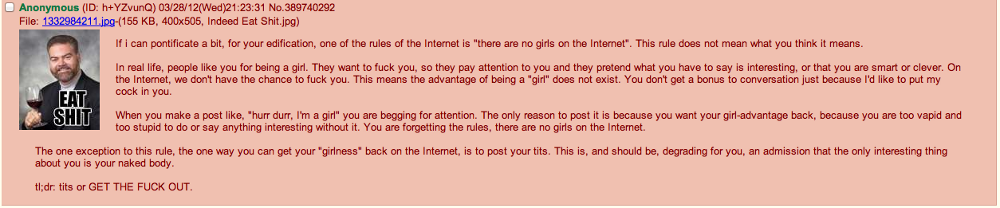

Rule #30 - There are NO girls on the internet.

If I can pontificate a bit, for your edification.
One of the rules of the Internet is: "there are no girls on the Internet."
This rule does not mean what you think it means.

In real life, people like you merely for being a girl.
They want to fuck you,
so they pay attention to you and they pretend what you have to say is interesting,
or that you are smart or clever.
On the Internet, we don't have a chance to fuck you;
this means the advantage of being a "girl" does not exist.
You don't get a bonus to conversation just because I'd like to put my cock in you.

When you make a post like "hurr durr, I'm a girl," you are begging for attention.
The only reason to post it is because you want your girl-advantage back,
because you are too vapid or too stupid to do or say anything interesting without it.
You are forgetting the rules, there are no girls on the Internet.

The one exception to this rule,
the one way you can get your "girlness" back on the Internet,
is to post your tits.
This is, and should be, degrading for you,
an admission that the only interesting thing about you is your naked body.

tl;dr: TITS or GET THE FUCK OUT

